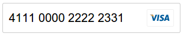

# &lt;react-input-creditcard&gt;

> CreditCard component which format your number and show the type of card using [React](http://facebook.github.io/react/index.html).


## Example



## Install

Install the component using [Bower](http://bower.io/):

```sh
bower install react-input-creditcard --save
```

Or [download as ZIP](https://github.com/mutebg/react-input-creditcard/archive/master.zip).


## Options

Attribute       | Options       | Default       | Description
---             | ---           | ---           | ---
`name`          | *string*      | none          | Input name.
`value`         | *string*      | none          | Input value.
`placeholder`   | *string*      | none          | Input placeholder.
`disabled`      | *boolean*     | false         | Disabled input.
`readonly`      | *boolean*     | false         | Input is readonly.
`required`      | *boolean*     | false         | Input is required.

## Contributing

1. Fork it!
2. Create your feature branch: `git checkout -b my-new-feature`
3. Commit your changes: `git commit -m 'Add some feature'`
4. Push to the branch: `git push origin my-new-feature`
5. Submit a pull request :D

## History

For detailed changelog, check [Releases](https://github.com/mutebg/react-input-creditcard/releases).

## License

[MIT License](http://opensource.org/licenses/MIT)